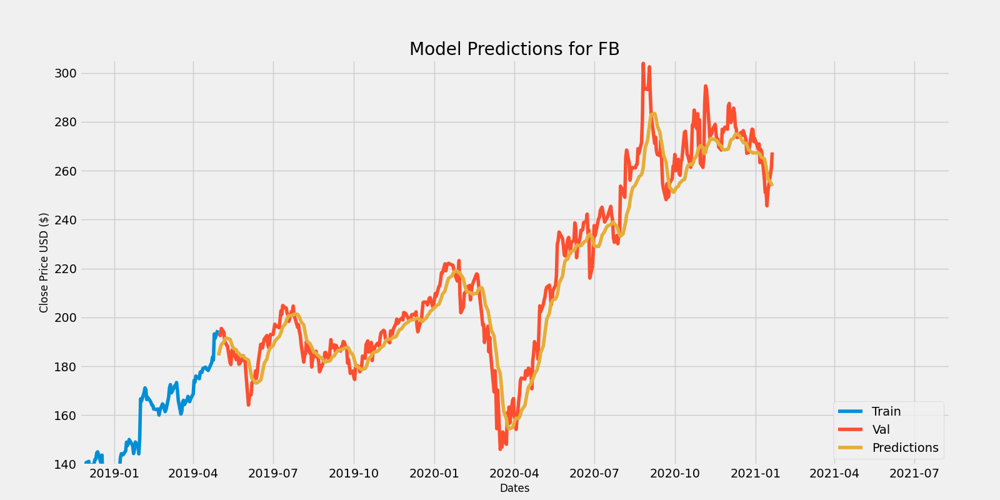
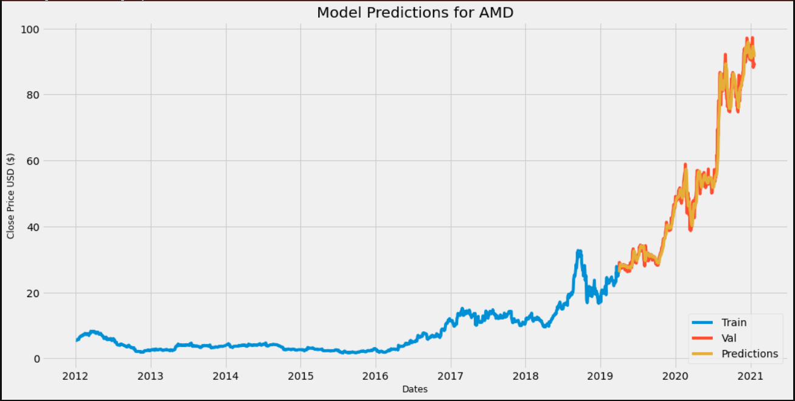

# ML_price_predictions
Trying to predict prices with ML. Not any algo-trading yet.

### What this does
This code uses the LSTM neural networks from Keras to build a model to predict the stocks prices.

It does so by predicting every day's closing price for the stock given 60 days of previous data.

So far here are my results!

I hope to add order triggers for algo-trading soon!
